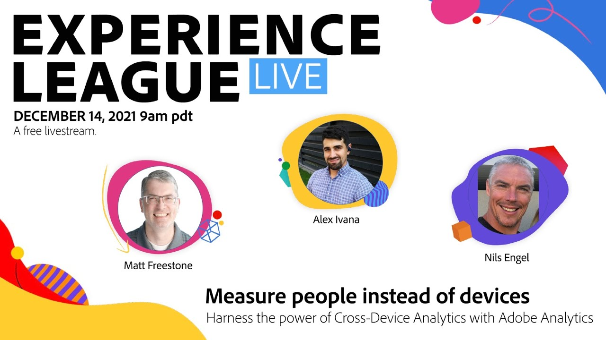

# Experience League LIVE

Experience League LIVE is a live streaming show produced by the Experience League team.  It's a chance to connect with Adobe product experts and learn actionable tips, tricks, and strategies you can apply with the Adobe Experience Cloud applications.

## Upcoming Experience League LIVE events!

<table>
<tr>
  <td>
      
     

          <strong>Customer Journey Analytics</strong>
     

          <em>January 25, 2022</em>
     

     

    

    <em>Learn cool tips from Adobe Customer Journey Analytics experts, who will show us how to widen the scope of our analytics across datasets.</em>
    

  </td>
    <td>
      
     

          <strong>AEM Reference Demos Add-On</strong>
     

          <em>January 27, 2022</em>
     

     

    

    <em>Learn all about the new Reference Demos for Adobe Experience Manager as a Cloud Service.</em>
    

  </td>
</tr>
</table>

## Past episodes

Did you miss an episode of Experience League LIVE? We forgive you. Check out any of our past episodes! You can explore below or use the left navigation to choose an episode.

<table>
<tr> 
  <td>
    
     

          <strong>Guests</strong> : <i>Mark Sculc, Sarah Xu, Zoran Nikolovski</i>
     

     

          <em>December 16, 2021</em>
     
    
    

    <em></em>
    

  </td>
</tr>
<tr> 
  <td>
    
     

          <strong>Guests</strong> : <i>Matt Freestone, Alex Ivana, Nils Engel</i>
     

     

          <em>December 14, 2021</em>
     
    
    

    <em></em>
    

  </td>
</tr>
<tr> 
  <td>
    
     

          <strong>Guests</strong> : <i>Gabriel Walt, Shankari Panchapakesan</i>
     

     

          <em>November 18, 2021</em>
     
    
    

    <em></em>
    

  </td>
</tr>
<tr> 
  <td>
    
     

          <strong>Guests</strong> : <i>Jenn Kunz - 33 Sticks, Adam Klintworth - Adobe</i>
     

     

          <em>October 21, 2021</em>
     
    
    

    <em></em>
    

  </td>
</tr>
<tr> 
  <td>
    
     

          <strong>Guests</strong> : <i>Alyssa Nahatis, Stephen Ford, Bruce Swann</i>
     

     

          <em>September 22, 2021</em>
     
    
    

    <em></em>
    

  </td>
</tr>
<tr> 
  <td>
    
     

          <strong>Guests</strong> : <i>Aaron Shields, Yaya Wang, and Andres Monroy</i>
     

     

          <em>August 26, 2021</em>
     
    
    

    <em></em>
    

  </td>
</tr>
<tr>
  <td>
    
     

          <strong>Guests</strong> : <i>Eric Matisoff and Dasha Fitzpatrick</i>
     

     

          <em>July 29, 2021</em>
     
    
    

    <em></em>
    

  </td>
</tr>
</table>

>[!TIP]
>
>For additional methods of learning, check out our free [courses](https://experienceleague.adobe.com/#dashboard/learning) as well as individual [tutorials](https://experienceleague.adobe.com/docs/home-tutorials.html).
